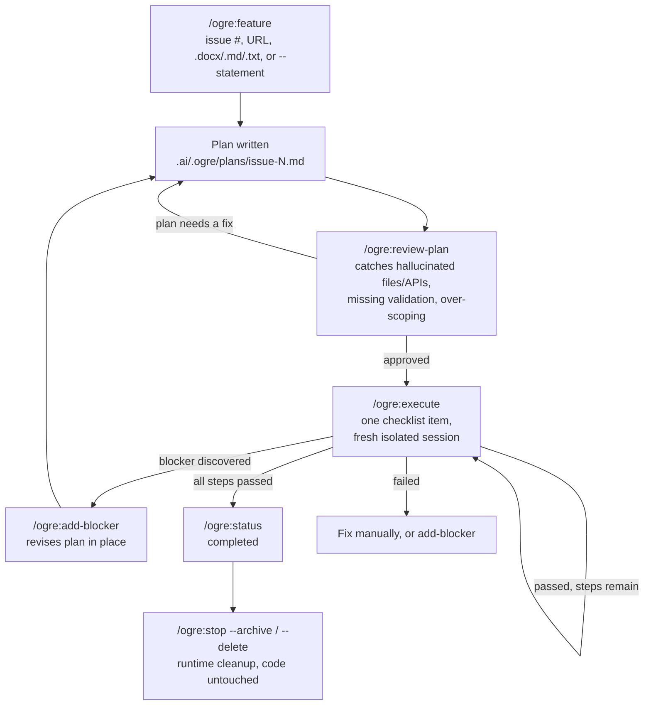

# Ogre

**A Claude Code plugin that turns "implement this feature" into a controlled, resumable, context-safe pipeline: plan it, review it, then execute one step at a time or chain the remaining steps with `--all`, with Claude or Codex doing the work.**

> **⚠️ Development tool only — not for production environments.** `--executor codex` runs every step with `--dangerously-bypass-approvals-and-sandbox`: no filesystem/shell/network confinement, no approvals, unconditional. Needed for real registry access and browser spawning. Use only in a disposable dev env or repo you'd give full local access to — never on production data, secrets, or an untrusted machine. `claude` sandboxes fine, no tradeoff needed.

## The problem

Ask Claude Code to implement a non-trivial feature directly in one long chat session, and a few things tend to go wrong:

- **Context rot.** The chat becomes too full of code changes, tool outputs, and discussions. After a while, Claude may start forgetting earlier decisions, and the quality of the answers can get worse.
- **No review gate.** Claude may start editing the code before the plan is properly checked. Because of that, mistakes like wrong method names, missing files, or incorrect assumptions may only be found after the code has already been changed.
- **No persistent state.** If the session crashes, gets compacted, or you close your laptop, it can be hard to know what was already completed. You may need to check Git diffs and rely on memory to continue.
- **One context doing two jobs.** The same chat is used for planning, reading files, writing code, fixing errors, and deciding the next step. This creates too much noise in one conversation.
- **Blockers break the flow.** If you remember a missing requirement halfway through, you usually need to explain everything again. Sometimes Claude may lose the original direction or start over instead of continuing smoothly.

## Real Use Case: As Easy As This

Start from a sentence. No GitHub issue or setup step required:

```
/ogre:feature --statement "need to implement forgot password page" --name forgot-password
```

Ogre creates `.ai/.ogre/` automatically and writes a checklist plan to `.ai/.ogre/plans/issue-forgot-password.md`. Open it and edit by hand if you want, or run a second LLM pass over it — optional, but useful before bigger changes:

```
/ogre:review-plan forgot-password --reviewer codex
# --reviewer default is claude; codex shown here as the alternative
```

Then execute one step at a time, or run every remaining step in one go with `--all`:

```
/ogre:execute forgot-password --executor codex
# --executor default is claude; codex shown here as the alternative
# Or chain through every remaining step automatically:
/ogre:execute forgot-password --all --executor codex
```

Each execute run uses fresh Codex/Claude sessions, so your main Claude Code chat stays clean. Progress is stored on disk, so you can check or resume later:

```
/ogre:status forgot-password
```

Forgot a requirement halfway through? Add it without restarting:

```
/ogre:add-blocker forgot-password --statement "must also invalidate old reset tokens"
```

## Claude → Codex, or Claude → Claude

Ogre doesn't care which LLM CLI does the planning versus the execution: `--planner`/`--reviewer`/`--executor` each independently accept `claude` or `codex`. Common splits:

- **Claude plans and reviews, Codex executes** (`--executor codex`): Claude's reasoning for the plan/review gate, Codex for the actual file edits.
- **Claude does everything** (`--executor claude`): every step still gets a fresh, isolated Claude session, so context isolation applies even without Codex in the loop.
- **Inline, no subprocess** (`--main`): for a step trivial enough that spawning a new session is overkill. Explicitly opt-in only, since it's the one mode that *does* spend main-session context.

Either way, every `--run`/`--background` execution records the underlying CLI's own session id, so you can drop into that exact session yourself afterward (`claude --resume <id>` / `codex resume <id>`) if you want to look closer or take over manually.

## How it works



## Why this helps

- **Main session stays clean.** Implementation noise lives in a subprocess's own context, not yours. Keep planning/reviewing other work in the same conversation without it degrading.
- **Nothing lives only in a chat.** Plans, state, logs, and reviews are files under `.ai/.ogre/`: they survive a crash, a `/clear`, a restart, or a different agent picking up where you left off.
- **A review gate before code exists.** A made-up API call or a step that's grown too big gets caught while it's still a one-line fix in the plan, not a revert in the diff.
- **Small, auditable diffs.** One checklist item per execution means one focused, reviewable change, not a 40-file drop reviewed cold.
- **Executor-agnostic.** Mix Claude and Codex per job, or per step, based on what each is better at for that piece of work.
- **Works without GitHub.** Freeform `--statement`, issue links from GitLab/Bitbucket/self-hosted trackers, or local `.md`/`.txt`/`.docx` files. GitHub is one option, not a requirement.
- **Resumable natively.** Want to go hands-on? Drop straight into the same Claude or Codex session in your own terminal instead of staying inside Ogre's interface.

## Requirements

- **[Claude Code CLI](https://code.claude.com/docs/en/setup)** — required (you're already running it if you can install this plugin). Verified with `2.1.205`.
- **[GitHub CLI (`gh`)](https://cli.github.com/)** — optional, used to resolve GitHub issue numbers/URLs. Verified with `2.92.0`. Missing/unauthenticated/no-access all fall back to a placeholder issue file you paste content into manually.
- **[Codex CLI](https://developers.openai.com/codex/cli)** — optional. Default is `claude` for planner/reviewer/executor; pass `--planner`/`--reviewer`/`--executor codex` to use Codex instead. Verified with `0.143.0`. Missing it fails `--executor codex` (runner prompts can still be generated and run manually).
- **Windows** — `scripts/ogre` is a bash script requiring `python3` on PATH. No native cmd.exe/PowerShell support. Works under **WSL**. Untested under Git Bash (should work if `python3`/`gh`/`codex`/`claude` are all reachable from it).

## Installation

Ogre is distributed through its own marketplace. From inside Claude Code, in any project:

```
/plugin marketplace add metallurgical/ogre-runner
/plugin install ogre@ogre-runner
```

Then `/reload-plugins` if the session was already running. Try it:

```
/ogre:feature --statement "need to implement forgot password page" --name forgot-password
```

To update later:

```
/plugin marketplace update ogre-runner
```

## Recommended Workflow

**Main use case: freeform text, no GitHub issue required.** Just describe the feature in your own words:

```txt
/ogre:feature --statement "need to implement forgot password page" --name forgot-password
# Ogre writes the statement verbatim to .ai/.ogre/issues/issue-forgot-password.md
# and plans/executes it exactly like a real issue from here on

# Review and edit .ai/.ogre/plans/issue-forgot-password.md

/ogre:review-plan forgot-password --reviewer claude
# Fix plan comments manually until approved

/ogre:execute forgot-password --executor codex
# Executes next checklist item only

/ogre:execute forgot-password --executor codex
# Next checklist item

/ogre:status forgot-password
```

A GitHub issue number/URL/local file works the same way, as an alternative input:

```txt
/ogre:feature 107 --blocks 101,102
# Review and edit .ai/.ogre/plans/issue-107.md

/ogre:review-plan 107 --reviewer claude
# Fix plan comments manually until approved

/ogre:execute 107 --executor codex
# Executes/generates runner for next checklist item only

/ogre:execute 107 --executor codex
# Next checklist item

/ogre:status 107
```

Add a blocker discovered mid-flight (freeform or issue-based, same either way):

```txt
/ogre:add-blocker forgot-password --statement "must also invalidate old reset tokens" --name invalidate-tokens
# Plan is revised in place to account for the new blocker
# Refuses if execution already started for this issue - use /ogre:stop first, or --force to override (manual-risk)
```

See every checklist step for a job at once:

```txt
/ogre:task-list job-<uuid>
# One row per step: #, Task Id, Status, Executor, Step
# Get the job id from `Job Id` in /ogre:status <issue> output
```

## Command Reference

Invoke as `/ogre:<command> ...` inside Claude Code (or `scripts/ogre <command> ...` directly, same flags either way). Positional input always comes first, flags after, in any order. `task-complete` has no skill wrapper — run it via `scripts/ogre`. `ogre init` is optional too — other commands create the runtime folders automatically when needed.

### Valid `--model` IDs

`--model` is passed straight through to the underlying CLI, unvalidated. A wrong id doesn't fail loudly at plan/review time — it kills the run at launch. Use one of these:

**`claude` provider** (aliases resolve to the latest of that tier; full ids pin a specific release):

| Alias | Full id |
| :--- | :--- |
| `sonnet` | `claude-sonnet-5` |
| `opus` | `claude-opus-4-8` |
| `fable` | `claude-fable-5` |
| — | `claude-haiku-4-5-20251001` (no alias) |

**`codex` provider** — no fixed enum, OpenAI adds models over time; check `codex --help` or the [Codex CLI docs](https://developers.openai.com/codex/cli) for what your installed version accepts. Known-working at time of writing:

| Model | Notes |
| :--- | :--- |
| `gpt-5.6-sol` | Codex CLI default; also Ogre's `diff_reviewer` default |
| `gpt-5.6-terra` | |
| `gpt-5.6-luna` | |
| `gpt-5.5` | |
| `gpt-5.4` | |
| `gpt-5.4-mini` | |

Omit `--model` to use Ogre's per-role default in `.ai/.ogre/config.json` (`claude-sonnet-5` for planner/reviewer/executor, `gpt-5.6-sol` for the codex diff reviewer).

### Valid `--reasoning` levels

Same pass-through-unvalidated rule as `--model`. Omit `--reasoning` entirely to use whatever the CLI defaults to on its own — Ogre never sets one unless you pass the flag.

**`claude` provider** (`claude --help`): `low`, `medium`, `high`, `xhigh`, `max`.

**`codex` provider**: no fixed enum exposed by `codex exec --help` either (passed as `-c model_reasoning_effort=LEVEL`); `none`, `minimal`, `low`, `medium`, `high`, `xhigh` are known-accepted at time of writing - check the [Codex CLI docs](https://developers.openai.com/codex/cli) if your installed version differs.

### `/ogre:feature`

Starts a new workflow and generates the planning runner. It also creates the `.ai/.ogre/` runtime folders/templates automatically if they do not exist, so you do not need to run `ogre init` first. The main path is freeform text:

```
/ogre:feature --statement "need a forgot-password page" --name forgot-password
```

Use a positional issue number, URL, or local file when you already have one.

By default the planner runs in an isolated `claude -p`/`codex exec` subprocess, same model as `/ogre:execute` (foreground, blocking, main session's context untouched). `--main` opts back into running it inline in the current session (spends this session's own context); `--background` spawns the same isolated subprocess detached. `ogre status <issue>` self-heals a `--background` planner that died mid-run, same as it does for a stalled `--all` execute chain.

| Option | Example | Description |
| :--- | :--- | :--- |
| `--statement "..."` | `/ogre:feature --statement "need a forgot-password page"` | Freeform feature text, no issue needed at all |
| `--name NAME` | `/ogre:feature --statement "..." --name forgot-password` | Slug for runtime paths when using `--statement` (default: first ~4 words + short uuid) |
| `<issue>` (positional) | `/ogre:feature 107` | GitHub issue number (GitHub-only, resolved via `gh` + this project's git remote) |
| `<issue>` (positional) | `/ogre:feature https://github.com/acme/app/issues/107` | Full GitHub issue URL |
| `<issue>` (positional) | `/ogre:feature https://gitlab.com/acme/app/-/issues/9` | Any non-GitHub issue/page URL (GitLab, self-hosted GitLab, Bitbucket, Jira, etc.), fetched generically as page text, not via an API |
| `<issue>` (positional) | `/ogre:feature ./notes/bug-report.md` | Local file path (`.md`, `.txt` copied verbatim; `.docx` text-extracted) |
| `--blocks ref,ref` | `/ogre:feature --statement "..." --name forgot-password --blocks ./notes/auth-debt.md` | Comma-separated blockers (issue numbers/URLs/paths), fetched alongside the main input, no status remark |
| `--blocker REF --remarks "..."` | `/ogre:feature --statement "..." --name forgot-password --blocker ./notes/auth-debt.md --remarks "PR merged"` | One blocker plus a freeform status remark tied to it. Repeatable; `--remarks` annotates the blocker right before it; mix freely with `--blocks`. The remark is prepended to the blocker's file and shown to the planner so it can reason about what's already landed vs still in flight |
| `--plan NAME.md` | `/ogre:feature --statement "..." --name forgot-password --plan forgot-password-v2.md` | Custom plan output filename instead of the default issue-derived or statement-derived plan name |
| `--planner claude\|codex` | `/ogre:feature --statement "..." --name forgot-password --planner codex` | Which LLM CLI plans the feature (default: `claude`) |
| `--model MODEL` | `/ogre:feature --statement "..." --name forgot-password --planner codex --model gpt-5.6-sol` | Model override for the planner |
| `--reasoning LEVEL` | `/ogre:feature --statement "..." --name forgot-password --planner codex --reasoning high` | Reasoning effort for the planner. Omit it to use the CLI's own default - Ogre never forces one |
| `--browser-check` | `/ogre:feature --statement "..." --name forgot-password --browser-check` | Opt-in. Without it, the generated plan never tags a step `[BROWSER-CHECK]`, even ones that render/change UI - default assumes you'll verify the feature yourself. Pass it when you want automated browser verification as part of execution (see `[BROWSER-CHECK]` steps below) |
| `--main` | `/ogre:feature --statement "..." --name forgot-password --main` | Run planning inline in the current session instead of spawning an isolated subprocess. Opt-in only; defeats context-isolation if habitual |
| `--background` | `/ogre:feature --statement "..." --name forgot-password --background` | Spawn the isolated subprocess detached instead of blocking; check progress with `ogre status <issue>` |
| `--live` | `/ogre:feature --statement "..." --name forgot-password --live` | Streams progress live into the current session's TUI as it happens, instead of waiting for a final text summary. No effect with `--main` (no subprocess spawned) |

### `/ogre:add-blocker`

Attaches a new blocker to an issue already tracked by Ogre, and forces the plan to be revised. Refuses once execution has started (use `--force` to override; manual risk, since already-completed steps aren't retroactively revised).

```
/ogre:add-blocker 107 --statement "must also invalidate old reset tokens"
```

Accepts the same input types as `/ogre:feature` for the blocker itself. Re-planning uses the same isolated-subprocess-by-default model as `/ogre:feature`/`/ogre:execute` (`--main`/`--background` apply the same way), defaulting to whichever planner `/ogre:feature` already seeded for this issue if `--planner`/`--model`/`--reasoning` aren't passed:

| Option | Example | Description |
| :--- | :--- | :--- |
| `<issue>` (positional, required) | `/ogre:add-blocker 107 ...` | The already-tracked issue to attach the blocker to |
| `<blocker>` (positional) | `/ogre:add-blocker 107 108` | GitHub issue number (GitHub-only, resolved via `gh` + this project's git remote) |
| `<blocker>` (positional) | `/ogre:add-blocker 107 https://github.com/acme/app/issues/108` | Full GitHub issue URL |
| `<blocker>` (positional) | `/ogre:add-blocker 107 https://gitlab.com/acme/app/-/issues/9` | Any non-GitHub issue/page URL (GitLab, self-hosted GitLab, Bitbucket, Jira, etc.), fetched generically as page text |
| `<blocker>` (positional) | `/ogre:add-blocker 107 ./notes/blocker.docx` | Local file path (`.md`, `.txt` copied verbatim; `.docx` text-extracted) |
| `--statement "..."` | `/ogre:add-blocker 107 --statement "must invalidate old tokens"` | Freeform blocker text instead of an issue/URL/path |
| `--name SLUG` | `/ogre:add-blocker 107 --statement "..." --name invalidate-tokens` | Slug for the blocker's file, only used with `--statement` |
| `--remarks "..."` | `/ogre:add-blocker 107 108 --remarks "PR under review"` | Freeform status note tied to this blocker (e.g. merged / under review / blocking). Prepended to the blocker's file and shown to the planner; omit to store the blocker with no remark |
| `--force` | `/ogre:add-blocker 107 108 --force` | Override the "execution already started" refusal (skips retroactive revision of completed steps; surface this warning to the user, never pass silently) |
| `--planner claude\|codex` / `--model MODEL` / `--reasoning LEVEL` | `/ogre:add-blocker 107 108 --planner codex` | Which LLM CLI re-plans; defaults to the issue's already-seeded planner |
| `--main` | `/ogre:add-blocker 107 108 --main` | Run re-planning inline in the current session instead of spawning an isolated subprocess |
| `--background` | `/ogre:add-blocker 107 108 --background` | Spawn the isolated subprocess detached instead of blocking |
| `--live` | `/ogre:add-blocker 107 108 --live` | Streams progress live into the current session's TUI as it happens, instead of waiting for a final text summary. No effect with `--main` |

### `/ogre:review-plan`

Reviews a generated plan for hallucinations, missing validation, risky assumptions, over-scoped steps.

```
/ogre:review-plan 107 --reviewer claude
```

| Option | Example | Description |
| :--- | :--- | :--- |
| `<issue-or-plan>` (positional) | `/ogre:review-plan 107` | Issue number, plan name (`issue-107`), or plan path |
| `--reviewer claude\|codex` | `/ogre:review-plan 107 --reviewer codex` | Which LLM CLI reviews the plan (default: `claude`) |
| `--model MODEL` | `/ogre:review-plan 107 --reviewer codex --model gpt-5.6-sol` | Model override for the reviewer |
| `--reasoning LEVEL` | `/ogre:review-plan 107 --reviewer codex --reasoning high` | Reasoning effort for the reviewer. Omit it to use the CLI's own default - Ogre never forces one |
| `--main` | `/ogre:review-plan 107 --main` | Run the review inline in the current session instead of spawning an isolated subprocess |
| `--background` | `/ogre:review-plan 107 --background` | Spawn the isolated subprocess detached instead of blocking |
| `--live` | `/ogre:review-plan 107 --live` | Streams progress live into the current session's TUI as it happens, instead of waiting for a final text summary. No effect with `--main` |

Same isolated-subprocess-by-default model as `/ogre:feature`/`/ogre:execute`: default spawns and blocks, `--main` opts back into inline, `--background` detaches.

### `/ogre:execute`

Executes one checklist item (or all remaining, with `--all`) from an approved plan.

```
/ogre:execute 107 --executor codex
```

| Option | Example | Description |
| :--- | :--- | :--- |
| `<issue-or-plan>` (positional) | `/ogre:execute 107` | Issue number, plan name, or plan path |
| `--job JOB_ID` | `/ogre:execute --job job-6d7715e4-...` | Target by job id instead of issue/plan |
| `--executor codex\|claude` | `/ogre:execute 107 --executor codex` | Which LLM CLI executes the step (default: `claude` — always present since it's the host; use `codex` if installed) |
| `--model MODEL` | `/ogre:execute 107 --executor claude --model claude-sonnet-5` | Model override for the executor |
| `--reasoning LEVEL` | `/ogre:execute 107 --executor codex --reasoning high` | Reasoning effort for the executor - `claude -p` gets `--effort LEVEL`, `codex exec` gets `-c model_reasoning_effort=LEVEL`. Omit it to use the CLI's own default; Ogre never forces one |
| `--task TASK_ID` | `/ogre:execute 107 --task task-0f32a78f-...` | Target one specific seeded step out of order |
| `--step N` | `/ogre:execute 107 --step 3` | Target step N (1-based) out of order |
| `--retry` | `/ogre:execute 107 --retry` | Re-run the lowest failed step in a fresh session, with the failed attempt's exit code and log tail injected into the runner prompt - the failure becomes an input instead of a dead end to re-explain by hand. Not combinable with `--all` |
| `--all` | `/ogre:execute 107 --all` | Chain through every remaining step, each session handing off to a fresh one at the `--max-steps` cap or when it estimates ~50%+ context used, whichever comes first |
| `--max-steps N` | `/ogre:execute 107 --all --max-steps 5` | Hard cap on checklist items per chained session (default: 3). Self-assessed context estimates are unreliable, so the cap is the authoritative limit. Many tiny/trivial steps (e.g. scaffolding dozens of near-identical files)? Raise this so they batch into one session instead of one spawn per step |
| `--fresh` | `/ogre:execute 107 --fresh` | Force a brand-new context for this step (default) |
| `--resume` | `/ogre:execute 107 --resume` | Resume prior context for this step instead of starting fresh |
| `--main` | `/ogre:execute 107 --main` | Run inline in the current Claude Code session, no subprocess spawned. Opt-in only (Ogre auto-falls back to it only in single-step mode, as the browser-check fallback when no browser MCP is detected - `--all`/`--background` stop instead of falling back, see `[BROWSER-CHECK]` steps below); defeats Ogre's context-isolation purpose if habitual |
| `--mcp-config PATH` | `/ogre:execute 107 --mcp-config ./playwright-mcp.json` | Browser MCP config for the spawned `claude` session, so `[BROWSER-CHECK]` steps run isolated instead of falling back to `--main`. Also settable as `"browser_mcp"` in `.ai/.ogre/config.json` |
| `--background` | `/ogre:execute 107 --background` | Same isolation as default (new session) but detached/non-blocking |
| `--live` | `/ogre:execute 107 --live` | Streams progress live into the current session's TUI as it happens, instead of waiting for a final text summary. With `--all --live`, each step in the chain streams the same way as it hands off to the next. No effect with `--main` |
| `--yes` | `/ogre:execute 107 --yes` | Required to proceed non-interactively when the step/job was previously `stopped`, or jumping to an out-of-order step whose earlier steps aren't `passed`. Only pass after explicit user confirmation |

Default with no isolation flag: foreground, brand-new codex/claude session, targeting the lowest-numbered pending step.

Every runner prompt also includes the issue's **knowledge base** (`.ai/.ogre/state/issue-<n>-knowledge.md`, updated by each step so the next one starts oriented) and **repo drift** (commits/edits since the plan was last written), so a late step trusts current code over the plan's stale memory of it.

**`[BROWSER-CHECK]` steps** — opt-in: pass `--browser-check` to `/ogre:feature`, or plans never get the tag (you verify manually).

| Executor | Runs isolated (real browser) if... | Otherwise |
| :--- | :--- | :--- |
| `claude` | a browser MCP is found — ambient `claude mcp list`, `browser_mcp` in config.json, or `--mcp-config` | single-step: auto-falls back to `--main`, with a NOTE explaining why. `--all`/`--background`: **stops the chain instead** (see below) |
| `codex` | a browser MCP is present (codex is always unsandboxed now, so its own sandbox no longer blocks launching a real browser) | single-step: auto-falls back to `--main`, with a NOTE explaining why. `--all`/`--background`: **stops the chain instead** (see below) |

No browser MCP configured and the next step is `[BROWSER-CHECK]`? Behavior depends on mode:

* **Single-step** (`/ogre:execute 107`, no `--all`): silently falls back to `--main` and logs a NOTE - the step still completes automatically, no manual retrigger needed.
* **`--all` / `--background`**: does *not* fall back automatically. The chain exits with an error telling you to either finish that one step with `--main` then resume `--all`, or configure a browser MCP first. This applies both when the chain first launches on a `[BROWSER-CHECK]` step, and when a chain link finishes and hands off to the next one.

So passing `--browser-check` to `/ogre:feature` without a browser MCP configured won't silently skip or fail the check in `--all` mode - it halts the chain at that exact step until you resolve it.

```jsonc
// .ai/.ogre/config.json
{ "browser_mcp": "/path/to/playwright-mcp.json" }
```

**⚠️ Every codex step runs fully unsandboxed** (`--dangerously-bypass-approvals-and-sandbox`) — no filesystem, shell, or network confinement, no approval prompts, for every spawn, not just `[BROWSER-CHECK]` steps. See the warning at the top of this README before using `--executor codex`.

**Auto-fix on a failed `[BROWSER-CHECK]`** (automatic in `--all`/`--background`, no flag needed). A browser-check step can't edit files, so a real bug it finds would otherwise be a dead end. Instead Ogre inserts up to 2 ad-hoc `[AUTO-FIX n/2]` steps (full edit rights, same safety rules as any step) before re-checking, each in its own fresh session so the re-check is genuinely independent. Still failing after 2 → chain stops for real, step marked `failed`. Every attempt stays visible in the plan file; the originally planned steps are never touched.

### `/ogre:rescue`

A standalone hotfix/task runner - no plan, no job, no issue involved. For when going through `/ogre:feature` → `/ogre:review-plan` → `/ogre:execute` would be overkill for what you actually want done right now:

```
/ogre:rescue "fix error in login backend"
/ogre:rescue --statement "implement forgot password page" --rescuer codex
```

| Option | Example | Description |
| :--- | :--- | :--- |
| `<task>` (positional) | `/ogre:rescue "fix login bug"` | Freeform task description |
| `--statement "..."` | `/ogre:rescue --statement "fix login bug"` | Same as the positional form |
| `--rescuer claude\|codex` | `/ogre:rescue "..." --rescuer codex` | Which LLM CLI does the work (default: falls back to `defaults.rescuer` in `.ai/.ogre/config.json`, then `claude` - its own config role, separate from `defaults.executor`) |
| `--model MODEL` | `/ogre:rescue "..." --rescuer codex --model gpt-5.6-sol` | Model override for the rescuer |
| `--reasoning LEVEL` | `/ogre:rescue "..." --rescuer codex --reasoning high` | Reasoning effort for the rescuer. Omit it to use the CLI's own default - Ogre never forces one |
| `--name SLUG` | `/ogre:rescue "..." --name login-fix` | Slug for this rescue's log/tmp paths (`.ai/.ogre/{tmp,logs}/issue-rescue-<slug>/`). Default: derived from the first few words of the task text plus a short uuid, same scheme as `/ogre:feature --statement`'s auto-name |
| `--main` | `/ogre:rescue "..." --main` | Run inline in the current Claude Code session instead of spawning an isolated subprocess. Opt-in only; no task id is tracked in this mode since there's no subprocess to track |
| `--background` | `/ogre:rescue "..." --background` | Spawn the isolated subprocess detached instead of blocking |
| `--live` | `/ogre:rescue "..." --live` | Streams progress live into the current session's TUI as it happens, instead of waiting for a final text summary. No effect with `--main` |

Same isolated-subprocess-by-default model as `/ogre:execute` (foreground, blocking, new codex/claude session unless `--main`/`--background` say otherwise) - but always exactly one subprocess call, never a chain (no `--all`, `--task`/`--step`, or `--retry`). No `state/issue-<x>.json` is ever written; track a run via the task id it prints instead:

```
ogre status --task <id>
ogre stop --task <id>
```

Stays on whatever git branch is already checked out - it does not create or switch branches on its own.

### `/ogre:status`

Shows job/task progress from `.ai/.ogre` state. Also self-heals a `--all --background` chain whose driver process died outright with steps still pending (no crash trace, just gone) - detects the dead pid on the last chain task and auto-relaunches `--all --background` with the same executor/model. Never touches an issue you explicitly `stop`ped.

```
/ogre:status 107
```

| Option | Example | Description |
| :--- | :--- | :--- |
| `[issue]` (positional, optional) | `/ogre:status 107` | Show one issue's Job Summary + its tasks. Omit for every issue + every pending/running task |
| `--job JOB_ID` | `/ogre:status --job job-6d7715e4-...` | Same as `[issue]`, addressed by job id |
| `--tasks` | `/ogre:status --tasks` or `/ogre:status 107 --tasks` | List all tasks, optionally filtered to one issue |
| `--task TASK_ID` | `/ogre:status --task task-0f32a78f-...` | Show one task's full record |
| `--watch` | `/ogre:status --watch` | Live-refresh view (run standalone in another terminal), Ctrl-C to quit |
| `--interval N` | `/ogre:status --watch --interval 5` | Refresh seconds for `--watch` (default: 2) |

`/ogre:status`/`/ogre:execute` self-heal a missing `state.json` by backfilling it from the plan file, so hand-authored plans still work.

### `/ogre:task-list`

Lists every checklist step under one job, one row per step (including steps never executed yet).

```
/ogre:task-list job-6d7715e4-...
```

| Option | Example | Description |
| :--- | :--- | :--- |
| `<job-id>` (positional, required) | `/ogre:task-list job-6d7715e4-...` | Get the job id from `Job Id` in `/ogre:status <issue>` output |

### `ogre task-complete`

Internal — marks a task's ledger status. `--run`/`--background` executions call this automatically; you only need it yourself if you did the step's work directly instead of through `execute`.

```bash
scripts/ogre task-complete task-0f32a78f-... --status passed
```

| Option | Example | Description |
| :--- | :--- | :--- |
| `<task-id>` (positional, required) | `ogre task-complete task-0f32a78f-...` | The task id to mark |
| `--status passed\|failed` | `ogre task-complete task-0f32a78f-... --status passed` | Outcome to record (default: `passed`) |
| `--exit-code N` | `ogre task-complete task-0f32a78f-... --status failed --exit-code 1` | Optional exit code to record alongside the status |
| `--notes "..."` | `ogre task-complete task-0f32a78f-... --notes "reset route is POST /password/email, not /forgot"` | Findings the next step's fresh session must know (real signature/route found, deviation from plan, gotcha). Injected into every later runner prompt for the issue, so mid-step knowledge survives the session that discovered it |

### `/ogre:stop`

Stops, archives, or deletes Ogre runtime data. Does not revert code changes.

```
/ogre:stop 107
```

| Option | Example | Description |
| :--- | :--- | :--- |
| `[issue]` (positional, optional) | `/ogre:stop 107` | Stop the job: cascades to all its tasks (kills running pids, marks pending/running `stopped`) |
| `--job JOB_ID` | `/ogre:stop --job job-6d7715e4-...` | Same, addressed by job id |
| `--task TASK_ID` | `/ogre:stop --task task-0f32a78f-...` | Stop ONE task only; sibling tasks and job/issue state untouched |
| `--all` | `/ogre:stop --all` | Stop every tracked job (cascades to all their tasks) |
| `--archive` | `/ogre:stop 107 --archive` | Move the issue's runtime data to `.ai/.ogre/archive/issue-<n>-<timestamp>/` |
| `--delete` | `/ogre:stop 107 --delete` | Delete the issue's runtime data (after confirmation) |
| `--list` | `/ogre:stop 107 --list` | Print every runtime file/dir path for the issue without deleting, so the user can pick individually |

### `/ogre:config`

Prints `config.json`'s actual nested shape (not a flattened dot-path list), each line annotated with whether that value came from the file or a hardcoded fallback, and the CLI flag that overrides it for one invocation. Useful because config.json has no schema of its own — a key set in the wrong spot (e.g. top-level instead of inside `"defaults"`) just does nothing, silently.

```
/ogre:config
```

```jsonc
{
  "defaults": {
    "planner": { "provider": "claude", "model": "claude-sonnet-5" },        # config.json | override: --planner PROVIDER / --model MODEL (ogre feature)
    "plan_reviewer": { "provider": "claude", "model": "claude-sonnet-5" },  # config.json | override: --reviewer PROVIDER / --model MODEL (ogre review-plan)
    "executor": { "provider": "claude", "model": "claude-sonnet-5" },       # config.json | override: --executor PROVIDER / --model MODEL (ogre execute)
    "rescuer": { "provider": "claude", "model": "claude-sonnet-5" },       # config.json | override: --rescuer PROVIDER / --model MODEL (ogre rescue)
    "diff_reviewer": { "provider": "claude", "model": "claude-sonnet-5" }   # config.json | not read by any command yet
  },
  "browser_mcp": null                                                      # fallback | override: --mcp-config PATH (ogre execute, [BROWSER-CHECK] steps)
}
```

| Option | Example | Description |
| :--- | :--- | :--- |
| `--reset` | `/ogre:config --reset` | Back up the current `config.json` to `config.json.bak`, then overwrite it with fresh-install defaults — use when config.json has been hand-edited into a confusing state |

Precedence for every value shown: CLI flag on the command itself wins, then config.json, then the hardcoded fallback (`claude`/`claude-sonnet-5` for planner/reviewer/executor).

## Notes

- Ogre does not revert code changes.
- Ogre runtime state is file-based, so Claude and Codex can resume by reading `.ai/.ogre/state/` and `.ai/.ogre/plans/`.
- Default execution is one checklist item at a time.
- Use `--all` only when you deliberately want Ogre to chain through every remaining step automatically.
- Spawned executor sessions run with permissions fully bypassed (`claude -p --permission-mode bypassPermissions`, `codex exec --dangerously-bypass-approvals-and-sandbox`) - no interactive approval, by design, since nothing can prompt a headless subprocess. For codex this also means no sandbox confinement at all - see the warning at the top of this README.
- `/plugin marketplace update` alone does not update your install - only a version bump does. Update, then `/reload-plugins` (or reinstall) to actually pick up a new release.

## Suggested `.gitignore`

```gitignore
.ai/.ogre/
```

Ignore the whole folder, even on a team. `.ai/.ogre/state/tasks.json` is a single shared ledger for *every* issue in the repo, not per-issue - if two people run `ogre execute` on different features at the same time and both commit, they're both rewriting the same file. Committing `.ai/.ogre/` also means everyone's working directory fills up with every other person's in-flight issues, whether or not they touch them.

If you want a teammate to pick up specifically where you left off on the *same* issue, hand off the `.ai/.ogre/` folder directly (zip it, `rsync` it, whatever) instead of committing it.
