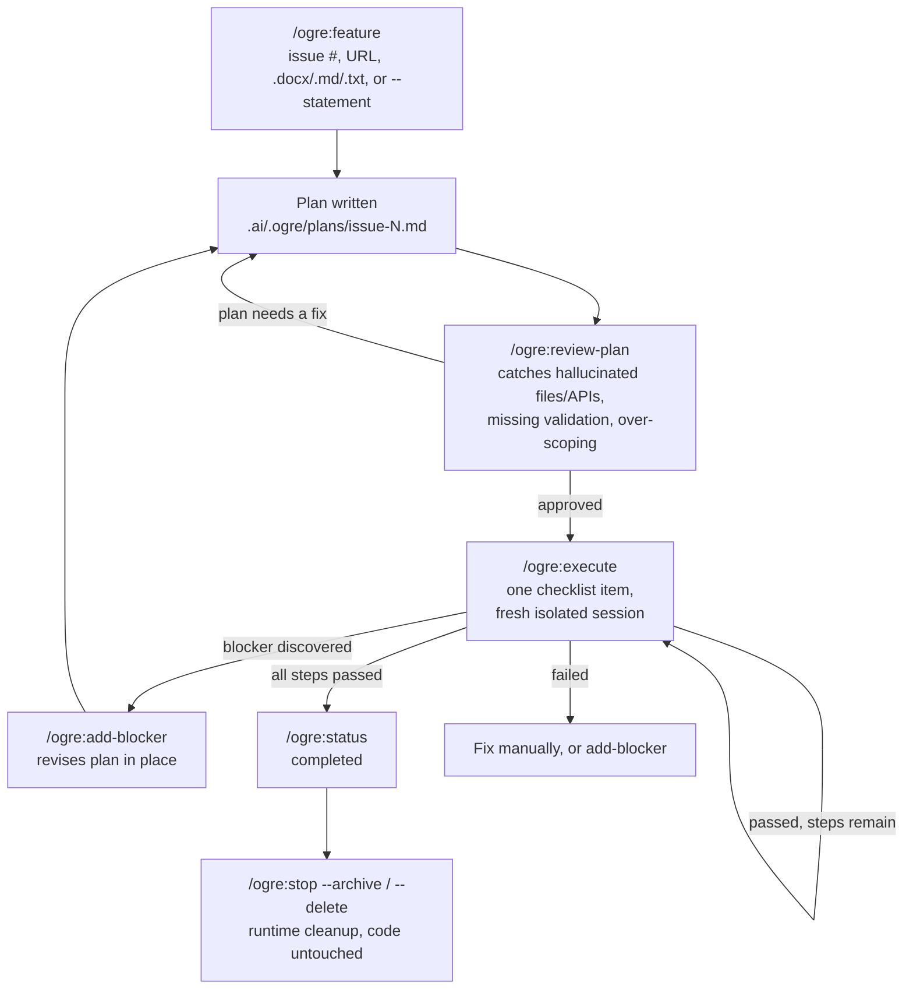

# Ogre

**A Claude Code plugin that turns "implement this feature" into a controlled, resumable, context-safe pipeline: plan it, review it, then execute one step at a time or chain the remaining steps with `--all`, with Claude or Codex doing the work.**

## The problem

Ask Claude Code to implement a non-trivial feature directly in one long chat session, and a few things tend to go wrong:

- **Context rot.** The chat becomes too full of code changes, tool outputs, and discussions. After a while, Claude may start forgetting earlier decisions, and the quality of the answers can get worse.
- **No review gate.** Claude may start editing the code before the plan is properly checked. Because of that, mistakes like wrong method names, missing files, or incorrect assumptions may only be found after the code has already been changed.
- **No persistent state.** If the session crashes, gets compacted, or you close your laptop, it can be hard to know what was already completed. You may need to check Git diffs and rely on memory to continue.
- **One context doing two jobs.** The same chat is used for planning, reading files, writing code, fixing errors, and deciding the next step. This creates too much noise in one conversation.
- **Blockers break the flow.** If you remember a missing requirement halfway through, you usually need to explain everything again. Sometimes Claude may lose the original direction or start over instead of continuing smoothly.

## Real Use Case: As Easy As This

Start from a sentence. No GitHub issue or setup step required:

```
/ogre:feature --statement "need to implement forgot password page" --name forgot-password
```

Ogre creates `.ai/.ogre/` automatically and generates a checklist plan. Review is optional, but useful before bigger changes:

```
/ogre:review-plan forgot-password --reviewer claude
```

Then execute one step at a time, or let Ogre chain every remaining step:

```
/ogre:execute forgot-password --executor codex
# Or chain through every remaining step automatically:
/ogre:execute forgot-password --all --executor codex
```

Each execute run uses fresh Codex/Claude sessions, so your main Claude Code chat stays clean. Progress is stored on disk, so you can check or resume later:

```
/ogre:status forgot-password
```

Forgot a requirement halfway through? Add it without restarting:

```
/ogre:add-blocker forgot-password --statement "must also invalidate old reset tokens"
```

## Claude → Codex, or Claude → Claude

Ogre doesn't care which LLM CLI does the planning versus the execution: `--planner`/`--reviewer`/`--executor` each independently accept `claude` or `codex`. Common splits:

- **Claude plans and reviews, Codex executes** (`--executor codex`): Claude's reasoning for the plan/review gate, Codex for the actual file edits.
- **Claude does everything** (`--executor claude`): every step still gets a fresh, isolated Claude session, so context isolation applies even without Codex in the loop.
- **Inline, no subprocess** (`--main`): for a step trivial enough that spawning a new session is overkill. Explicitly opt-in only, since it's the one mode that *does* spend main-session context.

Either way, every `--run`/`--background` execution records the underlying CLI's own session id, so you can drop into that exact session yourself afterward (`claude --resume <id>` / `codex resume <id>`) if you want to look closer or take over manually.

## How it works



## Why this helps

- **Main session stays clean.** Implementation noise lives in a subprocess's own context, not yours. Keep planning/reviewing other work in the same conversation without it degrading.
- **Nothing lives only in a chat.** Plans, state, logs, and reviews are files under `.ai/.ogre/`: they survive a crash, a `/clear`, a restart, or a different agent picking up where you left off.
- **A review gate before code exists.** A made-up API call or a step that's grown too big gets caught while it's still a one-line fix in the plan, not a revert in the diff.
- **Small, auditable diffs.** One checklist item per execution means one focused, reviewable change, not a 40-file drop reviewed cold.
- **Executor-agnostic.** Mix Claude and Codex per job, or per step, based on what each is better at for that piece of work.
- **Works without GitHub.** Freeform `--statement`, issue links from GitLab/Bitbucket/self-hosted trackers, or local `.md`/`.txt`/`.docx` files. GitHub is one option, not a requirement.
- **Resumable natively.** Want to go hands-on? Drop straight into the same Claude or Codex session in your own terminal instead of staying inside Ogre's interface.

## Requirements

Optional but recommended:

```bash
gh --version
codex --version
claude --version
```

If an issue can't be fetched automatically (`gh` missing, not a GitHub repo, not authenticated, no access, or an unreachable URL), Ogre creates a placeholder issue file so you can paste the content manually.

If `codex` is missing, `/ogre:execute --executor codex --run` will fail, but you can still generate runner prompts and pass them manually.

## Installation

Ogre is distributed through its own marketplace. From inside Claude Code, in any project:

```
/plugin marketplace add metallurgical/ogre-runner
/plugin install ogre@ogre-runner
```

Then `/reload-plugins` if the session was already running. Try it:

```
/ogre:feature --statement "need to implement forgot password page" --name forgot-password
```

To update later:

```
/plugin marketplace update ogre-runner
```

## Recommended Workflow

**Main use case: freeform text, no GitHub issue required.** Just describe the feature in your own words:

```txt
/ogre:feature --statement "need to implement forgot password page" --name forgot-password
# Ogre writes the statement verbatim to .ai/.ogre/issues/issue-forgot-password.md
# and plans/executes it exactly like a real issue from here on

# Review and edit .ai/.ogre/plans/issue-forgot-password.md

/ogre:review-plan forgot-password --reviewer claude
# Fix plan comments manually until approved

/ogre:execute forgot-password --executor codex
# Executes next checklist item only

/ogre:execute forgot-password --executor codex
# Next checklist item

/ogre:status forgot-password
```

A GitHub issue number/URL/local file works the same way, as an alternative input:

```txt
/ogre:feature 107 --blocks 101,102
# Review and edit .ai/.ogre/plans/issue-107.md

/ogre:review-plan 107 --reviewer claude
# Fix plan comments manually until approved

/ogre:execute 107 --executor codex
# Executes/generates runner for next checklist item only

/ogre:execute 107 --executor codex
# Next checklist item

/ogre:status 107
```

Add a blocker discovered mid-flight (freeform or issue-based, same either way):

```txt
/ogre:add-blocker forgot-password --statement "must also invalidate old reset tokens" --name invalidate-tokens
# Plan is revised in place to account for the new blocker
# Refuses if execution already started for this issue - use /ogre:stop first, or --force to override (manual-risk)
```

See every checklist step for a job at once:

```txt
/ogre:task-list job-<uuid>
# One row per step: #, Task Id, Status, Executor, Step
# Get the job id from `Job Id` in /ogre:status <issue> output
```

## Runtime Folder

Inside each target project, Ogre creates:

```txt
.ai/.ogre/
  config.json
  issues/
  plans/
  reviews/
  logs/
  state/                          # per-issue state.json, shared tasks.json ledger,
                                  # and issue-<n>-knowledge.md living knowledge bases
  tmp/
  archive/
  prompts/
```

## Command Reference

Invoke as `/ogre:<command> ...` inside Claude Code (or `scripts/ogre <command> ...` directly, same flags either way). Positional input always comes first, flags after, in any order. `task-complete` has no skill wrapper — run it via `scripts/ogre`. `ogre init` is optional too — other commands create the runtime folders automatically when needed.

### `/ogre:feature`

Starts a new workflow and generates the planning runner. It also creates the `.ai/.ogre/` runtime folders/templates automatically if they do not exist, so you do not need to run `ogre init` first. The main path is freeform text:

```
/ogre:feature --statement "need a forgot-password page" --name forgot-password
```

Use a positional issue number, URL, or local file when you already have one.

| Option | Example | Description |
| :--- | :--- | :--- |
| `--statement "..."` | `/ogre:feature --statement "need a forgot-password page"` | Freeform feature text, no issue needed at all |
| `--name NAME` | `/ogre:feature --statement "..." --name forgot-password` | Slug for runtime paths when using `--statement` (default: first ~4 words + short uuid) |
| `<issue>` (positional) | `/ogre:feature 107` | GitHub issue number (GitHub-only, resolved via `gh` + this project's git remote) |
| `<issue>` (positional) | `/ogre:feature https://github.com/acme/app/issues/107` | Full GitHub issue URL |
| `<issue>` (positional) | `/ogre:feature https://gitlab.com/acme/app/-/issues/9` | Any non-GitHub issue/page URL (GitLab, self-hosted GitLab, Bitbucket, Jira, etc.), fetched generically as page text, not via an API |
| `<issue>` (positional) | `/ogre:feature ./notes/bug-report.md` | Local file path (`.md`, `.txt` copied verbatim; `.docx` text-extracted) |
| `--blocks ref,ref` | `/ogre:feature --statement "..." --name forgot-password --blocks ./notes/auth-debt.md` | Comma-separated blockers (issue numbers/URLs/paths), fetched alongside the main input, no status remark |
| `--blocker REF --remarks "..."` | `/ogre:feature --statement "..." --name forgot-password --blocker ./notes/auth-debt.md --remarks "PR merged"` | One blocker plus a freeform status remark tied to it. Repeatable; `--remarks` annotates the blocker right before it; mix freely with `--blocks`. The remark is prepended to the blocker's file and shown to the planner so it can reason about what's already landed vs still in flight |
| `--plan NAME.md` | `/ogre:feature --statement "..." --name forgot-password --plan forgot-password-v2.md` | Custom plan output filename instead of the default issue-derived or statement-derived plan name |
| `--planner claude\|codex` | `/ogre:feature --statement "..." --name forgot-password --planner codex` | Which LLM CLI plans the feature (default: `claude`) |
| `--model MODEL` | `/ogre:feature --statement "..." --name forgot-password --planner codex --model gpt-5.5` | Model override for the planner |

### `/ogre:add-blocker`

Attaches a new blocker to an issue already tracked by Ogre, and forces the plan to be revised. Refuses once execution has started (use `--force` to override; manual risk, since already-completed steps aren't retroactively revised).

```
/ogre:add-blocker 107 --statement "must also invalidate old reset tokens"
```

Accepts the same input types as `/ogre:feature` for the blocker itself:

| Option | Example | Description |
| :--- | :--- | :--- |
| `<issue>` (positional, required) | `/ogre:add-blocker 107 ...` | The already-tracked issue to attach the blocker to |
| `<blocker>` (positional) | `/ogre:add-blocker 107 108` | GitHub issue number (GitHub-only, resolved via `gh` + this project's git remote) |
| `<blocker>` (positional) | `/ogre:add-blocker 107 https://github.com/acme/app/issues/108` | Full GitHub issue URL |
| `<blocker>` (positional) | `/ogre:add-blocker 107 https://gitlab.com/acme/app/-/issues/9` | Any non-GitHub issue/page URL (GitLab, self-hosted GitLab, Bitbucket, Jira, etc.), fetched generically as page text |
| `<blocker>` (positional) | `/ogre:add-blocker 107 ./notes/blocker.docx` | Local file path (`.md`, `.txt` copied verbatim; `.docx` text-extracted) |
| `--statement "..."` | `/ogre:add-blocker 107 --statement "must invalidate old tokens"` | Freeform blocker text instead of an issue/URL/path |
| `--name SLUG` | `/ogre:add-blocker 107 --statement "..." --name invalidate-tokens` | Slug for the blocker's file, only used with `--statement` |
| `--remarks "..."` | `/ogre:add-blocker 107 108 --remarks "PR under review"` | Freeform status note tied to this blocker (e.g. merged / under review / blocking). Prepended to the blocker's file and shown to the planner; omit to store the blocker with no remark |
| `--force` | `/ogre:add-blocker 107 108 --force` | Override the "execution already started" refusal (skips retroactive revision of completed steps; surface this warning to the user, never pass silently) |

### `/ogre:review-plan`

Reviews a generated plan for hallucinations, missing validation, risky assumptions, over-scoped steps.

```
/ogre:review-plan 107 --reviewer claude
```

| Option | Example | Description |
| :--- | :--- | :--- |
| `<issue-or-plan>` (positional) | `/ogre:review-plan 107` | Issue number, plan name (`issue-107`), or plan path |
| `--reviewer claude\|codex` | `/ogre:review-plan 107 --reviewer codex` | Which LLM CLI reviews the plan (default: `claude`) |
| `--model MODEL` | `/ogre:review-plan 107 --reviewer codex --model gpt-5.5` | Model override for the reviewer |

### `/ogre:execute`

Executes one checklist item (or all remaining, with `--all`) from an approved plan.

```
/ogre:execute 107 --executor codex
```

| Option | Example | Description |
| :--- | :--- | :--- |
| `<issue-or-plan>` (positional) | `/ogre:execute 107` | Issue number, plan name, or plan path |
| `--job JOB_ID` | `/ogre:execute --job job-6d7715e4-...` | Target by job id instead of issue/plan |
| `--executor codex\|claude` | `/ogre:execute 107 --executor codex` | Which LLM CLI executes the step (default: `claude` — always present since it's the host; use `codex` if installed) |
| `--model MODEL` | `/ogre:execute 107 --executor claude --model sonnet-5` | Model override for the executor |
| `--task TASK_ID` | `/ogre:execute 107 --task task-0f32a78f-...` | Target one specific seeded step out of order |
| `--step N` | `/ogre:execute 107 --step 3` | Target step N (1-based) out of order |
| `--retry` | `/ogre:execute 107 --retry` | Re-run the lowest failed step in a fresh session, with the failed attempt's exit code and log tail injected into the runner prompt - the failure becomes an input instead of a dead end to re-explain by hand. Not combinable with `--all` |
| `--all` | `/ogre:execute 107 --all` | Chain through every remaining step, each session handing off to a fresh one at the `--max-steps` cap or when it estimates ~50%+ context used, whichever comes first |
| `--max-steps N` | `/ogre:execute 107 --all --max-steps 5` | Hard cap on checklist items per chained session (default: 3). Self-assessed context estimates are unreliable, so the cap is the authoritative limit |
| `--fresh` | `/ogre:execute 107 --fresh` | Force a brand-new context for this step (default) |
| `--resume` | `/ogre:execute 107 --resume` | Resume prior context for this step instead of starting fresh |
| `--main` | `/ogre:execute 107 --main` | Run inline in the current Claude Code session, no subprocess spawned. Use only when explicitly requested; defeats Ogre's context-isolation purpose if habitual |
| `--background` | `/ogre:execute 107 --background` | Same isolation as default (new session) but detached/non-blocking |
| `--yes` | `/ogre:execute 107 --yes` | Required to proceed non-interactively when the step/job was previously `stopped`, or jumping to an out-of-order step whose earlier steps aren't `passed`. Only pass after explicit user confirmation |

Default with no isolation flag: foreground, brand-new codex/claude session, targeting the lowest-numbered pending step.

Every generated runner prompt also carries context blocks so a fresh session doesn't start blind: the issue's **living knowledge base** (see below), and repo drift — commits landed and uncommitted changes made since the plan file was last written — so a late step trusts the current code over the plan's stale memory of it.

**Living knowledge base.** Each issue keeps `.ai/.ogre/state/issue-<n>-knowledge.md`, updated in place by every step and read by the next, so fresh sessions start oriented instead of re-discovering facts.

**`[BROWSER-CHECK]` steps.** Steps needing real browser rendering are tagged and auto-run inline (`--main`) instead of in an isolated subprocess.

### `/ogre:status`

Shows job/task progress from `.ai/.ogre` state.

```
/ogre:status 107
```

| Option | Example | Description |
| :--- | :--- | :--- |
| `[issue]` (positional, optional) | `/ogre:status 107` | Show one issue's Job Summary + its tasks. Omit for every issue + every pending/running task |
| `--job JOB_ID` | `/ogre:status --job job-6d7715e4-...` | Same as `[issue]`, addressed by job id |
| `--tasks` | `/ogre:status --tasks` or `/ogre:status 107 --tasks` | List all tasks, optionally filtered to one issue |
| `--task TASK_ID` | `/ogre:status --task task-0f32a78f-...` | Show one task's full record |
| `--watch` | `/ogre:status --watch` | Live-refresh view (run standalone in another terminal), Ctrl-C to quit |
| `--interval N` | `/ogre:status --watch --interval 5` | Refresh seconds for `--watch` (default: 2) |

`/ogre:status`/`/ogre:execute` self-heal a missing `state.json` by backfilling it from the plan file, so hand-authored plans still work.

### `/ogre:task-list`

Lists every checklist step under one job, one row per step (including steps never executed yet).

```
/ogre:task-list job-6d7715e4-...
```

| Option | Example | Description |
| :--- | :--- | :--- |
| `<job-id>` (positional, required) | `/ogre:task-list job-6d7715e4-...` | Get the job id from `Job Id` in `/ogre:status <issue>` output |

### `ogre task-complete`

Internal — marks a task's ledger status. `--run`/`--background` executions call this automatically; you only need it yourself if you did the step's work directly instead of through `execute`.

```bash
scripts/ogre task-complete task-0f32a78f-... --status passed
```

| Option | Example | Description |
| :--- | :--- | :--- |
| `<task-id>` (positional, required) | `ogre task-complete task-0f32a78f-...` | The task id to mark |
| `--status passed\|failed` | `ogre task-complete task-0f32a78f-... --status passed` | Outcome to record (default: `passed`) |
| `--exit-code N` | `ogre task-complete task-0f32a78f-... --status failed --exit-code 1` | Optional exit code to record alongside the status |
| `--notes "..."` | `ogre task-complete task-0f32a78f-... --notes "reset route is POST /password/email, not /forgot"` | Findings the next step's fresh session must know (real signature/route found, deviation from plan, gotcha). Injected into every later runner prompt for the issue, so mid-step knowledge survives the session that discovered it |

### `/ogre:stop`

Stops, archives, or deletes Ogre runtime data. Does not revert code changes.

```
/ogre:stop 107
```

| Option | Example | Description |
| :--- | :--- | :--- |
| `[issue]` (positional, optional) | `/ogre:stop 107` | Stop the job: cascades to all its tasks (kills running pids, marks pending/running `stopped`) |
| `--job JOB_ID` | `/ogre:stop --job job-6d7715e4-...` | Same, addressed by job id |
| `--task TASK_ID` | `/ogre:stop --task task-0f32a78f-...` | Stop ONE task only; sibling tasks and job/issue state untouched |
| `--all` | `/ogre:stop --all` | Stop every tracked job (cascades to all their tasks) |
| `--archive` | `/ogre:stop 107 --archive` | Move the issue's runtime data to `.ai/.ogre/archive/issue-<n>-<timestamp>/` |
| `--delete` | `/ogre:stop 107 --delete` | Delete the issue's runtime data (after confirmation) |
| `--list` | `/ogre:stop 107 --list` | Print every runtime file/dir path for the issue without deleting, so the user can pick individually |

## Notes

- Ogre does not revert code changes.
- Ogre runtime state is file-based, so Claude and Codex can resume by reading `.ai/.ogre/state/` and `.ai/.ogre/plans/`.
- Default execution is one checklist item at a time.
- Use `--all` only when you deliberately want Ogre to chain through every remaining step automatically.

## Suggested `.gitignore`

For private solo workflow:

```gitignore
.ai/.ogre/
```

For team-visible plans but private logs:

```gitignore
.ai/.ogre/logs/
.ai/.ogre/tmp/
.ai/.ogre/reviews/
```
