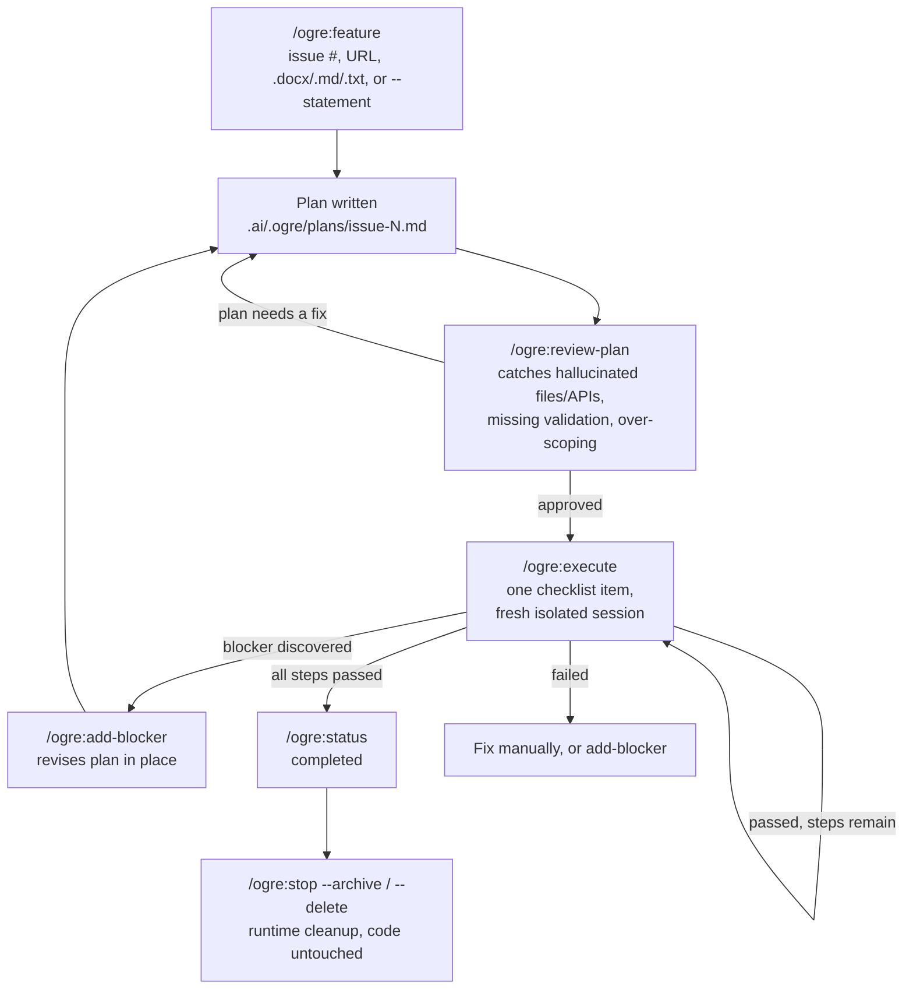
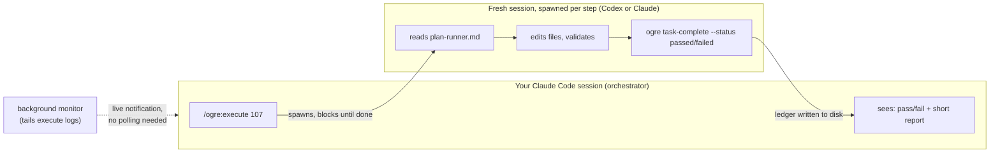

# Ogre

**A Claude Code plugin that turns "implement this feature" into a controlled, resumable, context-safe pipeline: plan it, review it, execute it one step at a time, with Claude or Codex doing the work.**

## The problem

Ask Claude Code to implement a non-trivial feature directly in one long chat session, and a few things tend to go wrong:

- **Context rot.** Big features fill the chat with diffs, tool output, and back-and-forth. A few steps in, Claude starts losing track of earlier decisions and the answers get worse.
- **No review gate.** Claude tends to start editing before it's really checked the plan. You only find the made-up method name or the missing file after it's already in the code.
- **No persistent state.** Crash the session, get compacted, or close the laptop mid-feature, and you're stuck piecing together what actually got done from `git diff` and memory.
- **One context doing two jobs.** The same conversation that should be deciding what's next also has to sit through every file read and failed attempt from actually doing the work. That's a lot of noise crammed into one thread.
- **Blockers break the flow.** Realize you forgot a requirement three steps into a plan, and normally that means re-explaining the whole thing and hoping Claude doesn't just start over.

## What Ogre does about it

Ogre keeps the whole workflow on disk (`.ai/.ogre/`) instead of just in the chat, and splits it into distinct phases: **feature → review-plan → execute → status → stop**, plus **add-blocker** for when you forgot something.

1. **`/ogre:feature`**: turns a GitHub issue, a GitLab/Bitbucket/Jira/self-hosted link, a local `.md`/`.txt`/`.docx` file, or a sentence you type (`--statement "..."`) into a written plan. No GitHub required.
2. **`/ogre:review-plan`**: a second LLM pass checks the plan against the real repo *before any code exists*, looking for made-up files or APIs, missing validation, and steps that have grown too big.
3. **`/ogre:execute`**: runs **one checklist item at a time**, each in its own fresh, isolated Codex or Claude session. The main Claude Code conversation never sees the implementation noise. It spawns the session, waits, and gets back a pass/fail plus a short report.
4. **`/ogre:status`** / **`/ogre:task-list`**: read progress straight off disk (`.ai/.ogre/state/`), so "what's done" is a file, not a memory.
5. **`/ogre:add-blocker`**: bolts on a newly-discovered requirement mid-flight; the plan is revised in place instead of restarted.
6. **`/ogre:stop`**: pauses, archives, or deletes the runtime data for an issue, without touching code changes already made.

## Real use case

You're working solo (or with a small team) in Claude Code. There's a backlog item, "add a forgot-password page," meaty enough to touch 3-4 files but not complex enough to deserve a design doc. You don't want to babysit it token-by-token, and you don't want one mega-session that degrades halfway through.

```
/ogre:feature --statement "need to implement forgot password page" --name forgot-password
```

Ogre writes the statement to disk and generates a plan. Before any code gets touched, run it past a review pass:

```
/ogre:review-plan forgot-password --reviewer claude
```

This is what catches, say, a step that assumed a `PasswordResetToken` model that doesn't exist. You fix the plan, approve it, then:

```
/ogre:execute forgot-password --executor codex
```

This spawns a brand-new Codex session with *only* the current checklist item and the relevant repo context. It edits the files, validates its own work, reports pass/fail, and exits. Your main Claude Code session's context usage barely moved: it saw a summary, not a transcript. Run the same command again for the next step. Check `/ogre:status forgot-password` any time, from a completely fresh session if you want, since it's reading files off disk, not conversation memory.

Halfway through, you realize you also need to invalidate old reset tokens:

```
/ogre:add-blocker forgot-password --statement "must also invalidate old reset tokens"
```

The plan is revised in place. No restart.

## Claude → Codex, or Claude → Claude

Ogre doesn't care which LLM CLI does the planning versus the execution: `--planner`/`--reviewer`/`--executor` each independently accept `claude` or `codex`. Common splits:

- **Claude plans and reviews, Codex executes** (`--executor codex`): Claude's reasoning for the plan/review gate, Codex for the actual file edits.
- **Claude does everything** (`--executor claude`): every step still gets a fresh, isolated Claude session, so context isolation applies even without Codex in the loop.
- **Inline, no subprocess** (`--main`): for a step trivial enough that spawning a new session is overkill. Explicitly opt-in only, since it's the one mode that *does* spend main-session context.

Either way, every `--run`/`--background` execution records the underlying CLI's own session id, so you can drop into that exact session yourself afterward (`claude --resume <id>` / `codex resume <id>`) if you want to look closer or take over manually.

## How it works



The isolation boundary that makes this useful:



## Why this helps

- **Main session stays clean.** Implementation noise lives in a subprocess's own context, not yours. Keep planning/reviewing other work in the same conversation without it degrading.
- **Nothing lives only in a chat.** Plans, state, logs, and reviews are files under `.ai/.ogre/`: they survive a crash, a `/clear`, a restart, or a different agent picking up where you left off.
- **A review gate before code exists.** A made-up API call or a step that's grown too big gets caught while it's still a one-line fix in the plan, not a revert in the diff.
- **Small, auditable diffs.** One checklist item per execution means one focused, reviewable change, not a 40-file drop reviewed cold.
- **Executor-agnostic.** Mix Claude and Codex per job, or per step, based on what each is better at for that piece of work.
- **Works without GitHub.** Freeform `--statement`, issue links from GitLab/Bitbucket/self-hosted trackers, or local `.md`/`.txt`/`.docx` files. GitHub is one option, not a requirement.
- **Resumable natively.** Want to go hands-on? Drop straight into the same Claude or Codex session in your own terminal instead of staying inside Ogre's interface.

## Runtime Folder

Inside each target project, Ogre creates:

```txt
.ai/.ogre/
  config.json
  issues/
  plans/
  reviews/
  logs/
  state/
  tmp/
  archive/
  prompts/
```

## Commands / Skills

Expected Claude Code commands:

```txt
/ogre:feature       # accepts an issue number/URL/local file, OR a freeform --statement (no issue needed)
/ogre:review-plan
/ogre:execute
/ogre:add-blocker   # attach a new blocker mid-flight (issue or freeform --statement)
/ogre:task-list     # list every checklist step for a job, one row per step
/ogre:stop
/ogre:status
```

The skills delegate deterministic setup to:

```txt
scripts/ogre
```

## Command Reference

All commands run as `scripts/ogre <command> ...` or via the matching `/ogre:<command>` skill (same flags either way). Positional input always comes first, flags after, in any order.

### `ogre init`

Creates the runtime folders and copies templates. No options.

### `ogre feature`

Starts a new issue workflow: fetch (or write) the issue, generate the planning runner.

| Option | Example | Description |
| :--- | :--- | :--- |
| `<issue>` (positional) | `ogre feature 107` | GitHub issue number (GitHub-only, resolved via `gh` + this project's git remote) |
| `<issue>` (positional) | `ogre feature https://github.com/acme/app/issues/107` | Full GitHub issue URL |
| `<issue>` (positional) | `ogre feature https://gitlab.com/acme/app/-/issues/9` | Any non-GitHub issue/page URL (GitLab, self-hosted GitLab, Bitbucket, Jira, etc.), fetched generically as page text, not via an API |
| `<issue>` (positional) | `ogre feature ./notes/bug-report.md` | Local file path (`.md`, `.txt` copied verbatim; `.docx` text-extracted) |
| `--statement "..."` | `ogre feature --statement "need a forgot-password page"` | Freeform feature text, no issue needed at all |
| `--name NAME` | `ogre feature --statement "..." --name forgot-password` | Slug for runtime paths when using `--statement` (default: first ~4 words + short uuid) |
| `--blocks 1,2,url,path` | `ogre feature 107 --blocks 101,102` | Comma-separated blockers (issue numbers/URLs/paths), fetched alongside the main issue, no status remark |
| `--blocker REF --remarks "..."` | `ogre feature 107 --blocker 101 --remarks "PR merged" --blocker 102 --remarks "under review"` | One blocker plus a freeform status remark tied to it. Repeatable; `--remarks` annotates the blocker right before it; mix freely with `--blocks`. The remark is prepended to the blocker's file and shown to the planner so it can reason about what's already landed vs still in flight |
| `--plan NAME.md` | `ogre feature 107 --plan issue-107-v2.md` | Custom plan output filename instead of the default `issue-<n>.md` |
| `--planner claude\|codex` | `ogre feature 107 --planner codex` | Which LLM CLI plans the feature (default: `claude`) |
| `--model MODEL` | `ogre feature 107 --planner codex --model gpt-5.5` | Model override for the planner |

### `ogre add-blocker`

Attaches a new blocker to an issue already tracked by Ogre, and forces the plan to be revised. Refuses once execution has started (use `--force` to override; manual risk, since already-completed steps aren't retroactively revised).

Accepts the same input types as `ogre feature` for the blocker itself:

| Option | Example | Description |
| :--- | :--- | :--- |
| `<issue>` (positional, required) | `ogre add-blocker 107 ...` | The already-tracked issue to attach the blocker to |
| `<blocker>` (positional) | `ogre add-blocker 107 108` | GitHub issue number (GitHub-only, resolved via `gh` + this project's git remote) |
| `<blocker>` (positional) | `ogre add-blocker 107 https://github.com/acme/app/issues/108` | Full GitHub issue URL |
| `<blocker>` (positional) | `ogre add-blocker 107 https://gitlab.com/acme/app/-/issues/9` | Any non-GitHub issue/page URL (GitLab, self-hosted GitLab, Bitbucket, Jira, etc.), fetched generically as page text |
| `<blocker>` (positional) | `ogre add-blocker 107 ./notes/blocker.docx` | Local file path (`.md`, `.txt` copied verbatim; `.docx` text-extracted) |
| `--statement "..."` | `ogre add-blocker 107 --statement "must invalidate old tokens"` | Freeform blocker text instead of an issue/URL/path |
| `--name SLUG` | `ogre add-blocker 107 --statement "..." --name invalidate-tokens` | Slug for the blocker's file, only used with `--statement` |
| `--remarks "..."` | `ogre add-blocker 107 108 --remarks "PR under review"` | Freeform status note tied to this blocker (e.g. merged / under review / blocking). Prepended to the blocker's file and shown to the planner; omit to store the blocker with no remark |
| `--force` | `ogre add-blocker 107 108 --force` | Override the "execution already started" refusal (skips retroactive revision of completed steps; surface this warning to the user, never pass silently) |

### `ogre review-plan`

Reviews a generated plan for hallucinations, missing validation, risky assumptions, over-scoped steps.

| Option | Example | Description |
| :--- | :--- | :--- |
| `<issue-or-plan>` (positional) | `ogre review-plan 107` | Issue number, plan name (`issue-107`), or plan path |
| `--reviewer claude\|codex` | `ogre review-plan 107 --reviewer codex` | Which LLM CLI reviews the plan (default: `claude`) |
| `--model MODEL` | `ogre review-plan 107 --reviewer codex --model gpt-5.5` | Model override for the reviewer |

### `ogre execute`

Executes one checklist item (or all remaining, with `--all`) from an approved plan.

| Option | Example | Description |
| :--- | :--- | :--- |
| `<issue-or-plan>` (positional) | `ogre execute 107` | Issue number, plan name, or plan path |
| `--job JOB_ID` | `ogre execute --job job-6d7715e4-...` | Target by job id instead of issue/plan |
| `--executor codex\|claude` | `ogre execute 107 --executor claude` | Which LLM CLI executes the step (default: `codex`) |
| `--model MODEL` | `ogre execute 107 --executor claude --model sonnet-5` | Model override for the executor |
| `--task TASK_ID` | `ogre execute 107 --task task-0f32a78f-...` | Target one specific seeded step out of order |
| `--step N` | `ogre execute 107 --step 3` | Target step N (1-based) out of order |
| `--retry` | `ogre execute 107 --retry` | Re-run the lowest failed step in a fresh session, with the failed attempt's exit code and log tail injected into the runner prompt - the failure becomes an input instead of a dead end to re-explain by hand. Not combinable with `--all` |
| `--all` | `ogre execute 107 --all` | Chain through every remaining step, each session handing off to a fresh one at the `--max-steps` cap or when it estimates ~50%+ context used, whichever comes first |
| `--max-steps N` | `ogre execute 107 --all --max-steps 5` | Hard cap on checklist items per chained session (default: 3). Self-assessed context estimates are unreliable, so the cap is the authoritative limit |
| `--fresh` | `ogre execute 107 --fresh` | Force a brand-new context for this step (default) |
| `--resume` | `ogre execute 107 --resume` | Resume prior context for this step instead of starting fresh |
| `--main` | `ogre execute 107 --main` | Run inline in the current Claude Code session, no subprocess spawned. Use only when explicitly requested; defeats Ogre's context-isolation purpose if habitual |
| `--background` | `ogre execute 107 --background` | Same isolation as default (new session) but detached/non-blocking |
| `--yes` | `ogre execute 107 --yes` | Required to proceed non-interactively when the step/job was previously `stopped`, or jumping to an out-of-order step whose earlier steps aren't `passed`. Only pass after explicit user confirmation |

Default with no isolation flag: foreground, brand-new codex/claude session, targeting the lowest-numbered pending step.

Every generated runner prompt also carries two context blocks so a fresh session doesn't start blind: notes recorded by earlier sessions on the issue (`task-complete --notes`), and repo drift — commits landed and uncommitted changes made since the plan file was last written — so a late step trusts the current code over the plan's stale memory of it.

**`[BROWSER-CHECK]` steps.** A spawned codex/claude CLI subprocess (the default/`--background` isolation modes) has no real browser access - it can't visually render a page to verify layout or interactive behavior. Plan steps that genuinely need that are tagged `[BROWSER-CHECK]` by the planner. For single-step targeting, `ogre execute` detects the tag before spawning anything and auto-switches to `--main` itself, so it runs inline in your live session (where real browser/MCP tooling exists) without you having to retype the command. For `--all` chaining in the foreground, it instead stops the chain and tells you to finish that one step with `--main` before resuming - unattended multi-step runs shouldn't silently pause for inline work without saying so. For `--all --background`, if any remaining step in the plan is tagged `[BROWSER-CHECK]`, Claude launches a supervising fork alongside the detached run: it polls `ogre status`, resolves each `[BROWSER-CHECK]` step inline with real browser tooling the moment the chain reaches it, then resumes the background run - so an unattended chain with browser steps in it still completes without you having to notice the pause yourself.

### `ogre status`

Shows job/task progress from `.ai/.ogre` state.

| Option | Example | Description |
| :--- | :--- | :--- |
| `[issue]` (positional, optional) | `ogre status 107` | Show one issue's Job Summary + its tasks. Omit for every issue + every pending/running task |
| `--job JOB_ID` | `ogre status --job job-6d7715e4-...` | Same as `[issue]`, addressed by job id |
| `--tasks` | `ogre status --tasks` or `ogre status 107 --tasks` | List all tasks, optionally filtered to one issue |
| `--task TASK_ID` | `ogre status --task task-0f32a78f-...` | Show one task's full record |
| `--watch` | `ogre status --watch` | Live-refresh view (run standalone in another terminal), Ctrl-C to quit |
| `--interval N` | `ogre status --watch --interval 5` | Refresh seconds for `--watch` (default: 2) |

`ogre status <issue>` and `ogre execute <issue>` both self-heal a missing `state.json`: if `.ai/.ogre/plans/issue-N.md` exists but its ledger state doesn't (a hand-authored plan, or the state file got lost), they backfill a fresh state record from the plan instead of erroring "No state found" - so the pipeline keeps working even for plans created outside `ogre feature`. Backfilled records are flagged (`"backfilled": true`), and every runner prompt for such a job warns the executor that "pending" only reflects the plan's checkboxes - it must verify a step isn't already implemented before touching code, since re-editing finished work can damage it.

### `ogre task-list`

Lists every checklist step under one job, one row per step (including steps never executed yet).

| Option | Example | Description |
| :--- | :--- | :--- |
| `<job-id>` (positional, required) | `ogre task-list job-6d7715e4-...` | Get the job id from `Job Id` in `ogre status <issue>` output |

### `ogre task-complete`

Manually marks a task's ledger status. Only needed when the executing agent did the work directly (not via `--run`/`--background`, which mark it automatically); this is the mandatory last step in that case.

| Option | Example | Description |
| :--- | :--- | :--- |
| `<task-id>` (positional, required) | `ogre task-complete task-0f32a78f-...` | The task id to mark |
| `--status passed\|failed` | `ogre task-complete task-0f32a78f-... --status passed` | Outcome to record (default: `passed`) |
| `--exit-code N` | `ogre task-complete task-0f32a78f-... --status failed --exit-code 1` | Optional exit code to record alongside the status |
| `--notes "..."` | `ogre task-complete task-0f32a78f-... --notes "reset route is POST /password/email, not /forgot"` | Findings the next step's fresh session must know (real signature/route found, deviation from plan, gotcha). Injected into every later runner prompt for the issue, so mid-step knowledge survives the session that discovered it |

### `ogre stop`

Stops, archives, or deletes Ogre runtime data. Does not revert code changes.

| Option | Example | Description |
| :--- | :--- | :--- |
| `[issue]` (positional, optional) | `ogre stop 107` | Stop the job: cascades to all its tasks (kills running pids, marks pending/running `stopped`) |
| `--job JOB_ID` | `ogre stop --job job-6d7715e4-...` | Same, addressed by job id |
| `--task TASK_ID` | `ogre stop --task task-0f32a78f-...` | Stop ONE task only; sibling tasks and job/issue state untouched |
| `--all` | `ogre stop --all` | Stop every tracked job (cascades to all their tasks) |
| `--archive` | `ogre stop 107 --archive` | Move the issue's runtime data to `.ai/.ogre/archive/issue-<n>-<timestamp>/` |
| `--delete` | `ogre stop 107 --delete` | Delete the issue's runtime data (after confirmation) |
| `--list` | `ogre stop 107 --list` | Print every runtime file/dir path for the issue without deleting, so the user can pick individually |

## Installation

Ogre is distributed through its own marketplace. From inside Claude Code, in any project:

```
/plugin marketplace add metallurgical/ogre-runner
/plugin install ogre@ogre-runner
```

Then `/reload-plugins` if the session was already running. Try it:

```
/ogre:feature --statement "need to implement forgot password page" --name forgot-password
```

To update later:

```
/plugin marketplace update ogre-runner
```

## Install / Test Locally (development)

Testing a local checkout without going through the marketplace:

```bash
claude --plugin-dir /path/to/ogre-plugin
```

Then open your project in Claude Code and try:

```txt
/ogre:feature 107 --blocks 101,102
```

The helper script can also be run directly from a project root:

```bash
/path/to/ogre-plugin/scripts/ogre init
/path/to/ogre-plugin/scripts/ogre feature 107 --blocks 101,102
/path/to/ogre-plugin/scripts/ogre status
```

## Required Tools

Optional but recommended:

```bash
gh --version
codex --version
claude --version
```

If `gh` is missing, Ogre creates placeholder issue files so you can paste issue content manually.

If `codex` is missing, `/ogre:execute --executor codex --run` will fail, but you can still generate runner prompts and pass them manually.

## Recommended Workflow

**Main use case: freeform text, no GitHub issue required.** Just describe the feature in your own words:

```txt
/ogre:feature --statement "need to implement forgot password page" --name forgot-password
# Ogre writes the statement verbatim to .ai/.ogre/issues/issue-forgot-password.md
# and plans/executes it exactly like a real issue from here on

# Review and edit .ai/.ogre/plans/issue-forgot-password.md

/ogre:review-plan forgot-password --reviewer claude
# Fix plan comments manually until approved

/ogre:execute forgot-password --executor codex
# Executes next checklist item only

/ogre:execute forgot-password --executor codex
# Next checklist item

/ogre:status forgot-password
```

A GitHub issue number/URL/local file works the same way, as an alternative input:

```txt
/ogre:feature 107 --blocks 101,102
# Review and edit .ai/.ogre/plans/issue-107.md

/ogre:review-plan 107 --reviewer claude
# Fix plan comments manually until approved

/ogre:execute 107 --executor codex
# Executes/generates runner for next checklist item only

/ogre:execute 107 --executor codex
# Next checklist item

/ogre:status 107
```

Add a blocker discovered mid-flight (freeform or issue-based, same either way):

```txt
/ogre:add-blocker forgot-password --statement "must also invalidate old reset tokens" --name invalidate-tokens
# Plan is revised in place to account for the new blocker
# Refuses if execution already started for this issue - use /ogre:stop first, or --force to override (manual-risk)
```

See every checklist step for a job at once:

```txt
/ogre:task-list job-<uuid>
# One row per step: #, Task Id, Status, Executor, Step
# Get the job id from `Job Id` in /ogre:status <issue> output
```

## Direct CLI Usage

Create runtime folders and copy templates:

```bash
scripts/ogre init
```

Fetch issues and generate planning runner:

```bash
scripts/ogre feature 107 --blocks 101,102
```

Or skip the issue entirely and describe the feature in your own words:

```bash
scripts/ogre feature --statement "need to implement forgot password page" --name forgot-password
```

Add a blocker to an in-flight issue (freeform or issue-based):

```bash
scripts/ogre add-blocker 107 --statement "must also invalidate old reset tokens" --name invalidate-tokens
```

List every checklist step for a job:

```bash
scripts/ogre task-list job-<uuid>
```

Generate review runner:

```bash
scripts/ogre review-plan 107 --reviewer claude
```

Generate execution runner:

```bash
scripts/ogre execute 107 --executor codex
```

Run Codex directly:

```bash
scripts/ogre execute 107 --executor codex --model gpt-5.5 --run
```

Run Claude directly:

```bash
scripts/ogre execute 107 --executor claude --model sonnet-5 --run
```

Stop/pause issue:

```bash
scripts/ogre stop 107
```

Archive issue runtime data:

```bash
scripts/ogre stop 107 --archive
```

Delete issue runtime data:

```bash
scripts/ogre stop 107 --delete
```

## Notes

- Ogre does not revert code changes.
- Ogre runtime state is file-based, so Claude and Codex can resume by reading `.ai/.ogre/state/` and `.ai/.ogre/plans/`.
- Default execution is one checklist item at a time.
- `--all` is reserved for future improvement; use one-step execution until the workflow is proven.

## Suggested `.gitignore`

For private solo workflow:

```gitignore
.ai/.ogre/
```

For team-visible plans but private logs:

```gitignore
.ai/.ogre/logs/
.ai/.ogre/tmp/
.ai/.ogre/reviews/
```
